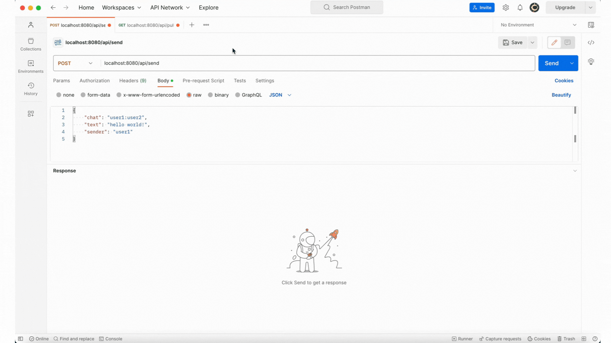
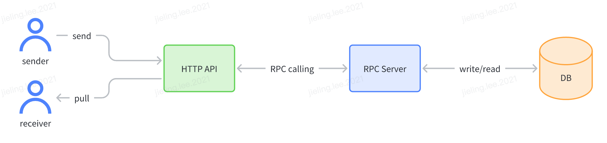

<a name="readme-top"></a>

<!-- PROJECT LOGO -->
<br />
<div align="center">
 
  <h3 align="center">Backend Instant Messaging System</h3>

  <p align="center">
    This is a server assignment for Tiktok Tech Immersion 2023
  </p>
</div>

<!-- TABLE OF CONTENTS -->
<details>
  <summary>Table of Contents</summary>
  <ol>
    <li>
      <a href="#about-the-project">About The Project</a>
      <ul>
        <li><a href="#built-with">Built With</a></li>
        <li><a href="#kitex">Kitex</a></li>
        <li><a href="#hertx">Hertz</a></li>
      </ul>
    </li>
    <li>
      <a href="#getting-started">Getting Started</a>
      <ul>
        <li><a href="#prerequisites">Prerequisites</a></li>
        <li><a href="#running-using-kubernetes">Running using Kubernetes</a></li>
        <li><a href="#running-using-docker-compose">Running using Docker Compose</a></li>
        <li><a href="#result">Result</a></li>
      </ul>
    </li>
    <li><a href="#api-documentation">API Documentation</a></li>
  </ol>
</details>

<!-- ABOUT THE PROJECT -->

## About The Project

 

This assignment is about designing and developing an IM system by implementing a set of specific APIs using Golang. This project only contains the backend side of the system, focusing on core message features without the front-end part and the account/authentication part.

It has two main features:

- Sender can send a message to a receiver, and message will be stored in the database
- Receiver can retrieve all messages sent to him/her through pull mocde

<p align="right">(<a href="#readme-top">back to top</a>)</p>

### Built With

This project is built with the following tools:

- Golang
- Kitex
- Hertz
- Redis
- Docker
- Kubernetes

<p align="right">(<a href="#readme-top">back to top</a>)</p>

### Kitex

- `kitex_gen` folder includes codes generated from `idl_rpc.thrift`. This generates RPC client code to be used in both HTTP Server and RPC Server
- If the definitions of `idl_rpc.thrift` file is modified, remember to regenerate the codes
- Install thrift compiler
  ```
  go install github.com/cloudwego/thriftgo
  ```
- Install Kitex
  ```
  go install github.com/cloudwego/kitex/tool/cmd/kitex@latest
  ```
- Generate the code for both http-server and rpc-server
  ```
  cd ./rpc-server
  kitex -module "github.com/ernst12/Backend_Server-TikTok_Tech_Immersion-Assignment/rpc-server" -service imservice ../idl_rpc.thrift
  cp -r ./kitex_gen ../http-server
  ```

<p align="right">(<a href="#readme-top">back to top</a>)</p>

### Hertx

- If you wish to modify the API definitions, remember to update `idl_http.proto` file and regenerate the code
- To regenerate the code:
- Install Protobuf (for MacOS)
  ```
  brew install protobuf
  ```
- Install protoc-gen-go plugin to generate idl code
  ```
  go install github.com/golang/protobuf/protoc-gen-go@latest
  ```
- Generate the new API definitions
  ```
  protoc --go_out=./http-server/proto_gen/api --go_opt=paths=source_relative ./idl_http.proto`
  ```

<p align="right">(<a href="#readme-top">back to top</a>)</p>

<!-- GETTING STARTED -->

## Getting Started

To get a local copy up and running follow these simple example steps.

### Prerequisites

Clone the repo into your local machine

```sh
gh repo clone Jaylin0312/TikTokImmersion_Assignment
```

### Running using Kubernetes

1. Build the docker images for both http-server and rpc-server

```
cd ./http-server
docker build -t http-server .
cd ../rpc-server
docker build -t rpc-server .
```

2. Publish the images to Docker Hub

```
docker tag http-server [your docker username]/http-server
docker push [your docker username]/http-server
docker tag rpc-server [your docker username]/rpc-server
docker push [your docker username]/rpc-server
```

3. Deploy the images to Kubernetes

```
kubectl apply -f ./k8
```

Extra notes:
Check the status of the pods

```
kubectl get pods
```

Check the status of the services

```
kubectl get services
```

If you want to delete the services and deployments created (after running the above command), you can run the following commands:

```
kubectl delete -f ./k8
```

### Running using Docker Compose

1. Run the following command to start the containers

```
docker-compose up
```

2. To stop the containers, run the following command

```
docker-compose down
```

### Result

You should now be able to access and test the APIs through the following endpoints using Postman or similar tool:

- http://localhost:8080/send
- http://localhost:8080/pull

<p align="right">(<a href="#readme-top">back to top</a>)</p>

## API Documentation

Send Message

1. Send message to receiver

- Endpoint: http://localhost:8080/send
- Method: POST
- Sample Request Body:

```json
{
  "chat": "user1:user2",
  "text": "hello world!",
  "sender": "user1"
}
```

2. You should be able to see the status code 200 OK

Pull Message

1. Pull message from redis database

- Endpoint: http://localhost:8080/pull
- Method: GET
- Sample Request Body:

```json
{
  "chat": "user1:user2",
  "limit": 10,
  "cursor": 0,
  "reverse": true
}
```

2. You should be able to see the status code 200 OK and the following response body:

```json
{
  "messages": [
    {
      "chat": "user1:user2",
      "text": "hello world!",
      "sender": "user1",
      "send_time": 1686674603
    }
  ]
}
```
